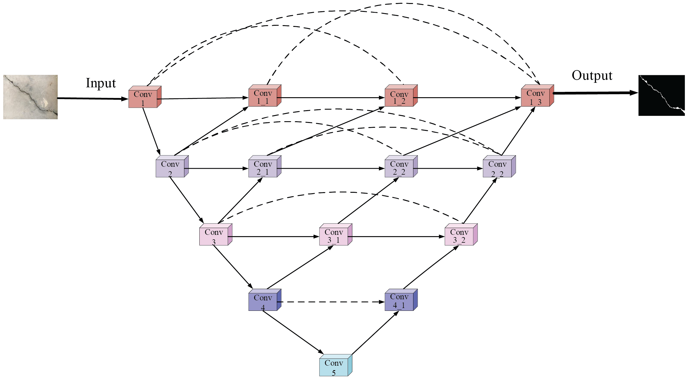
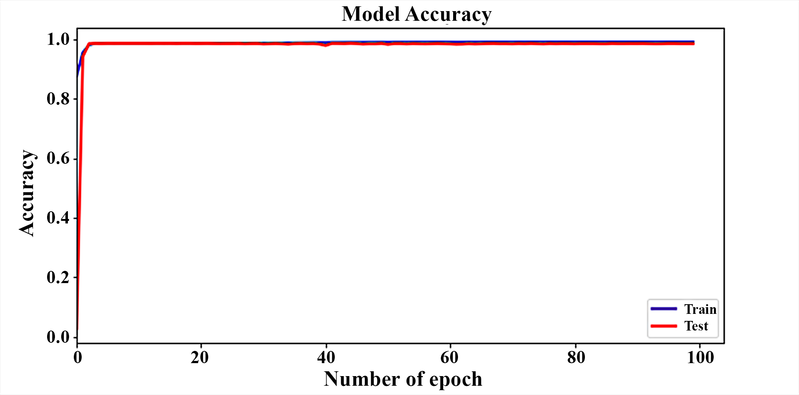
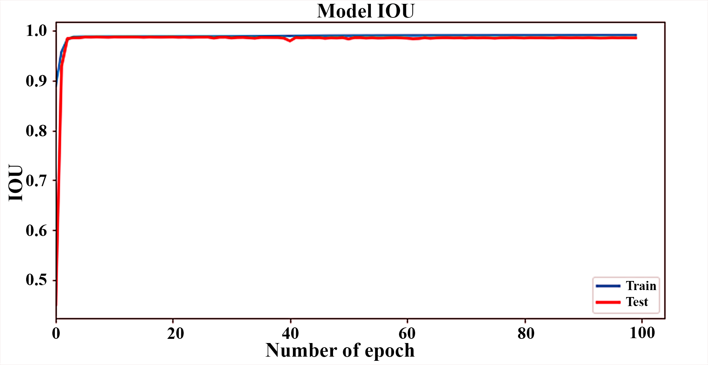
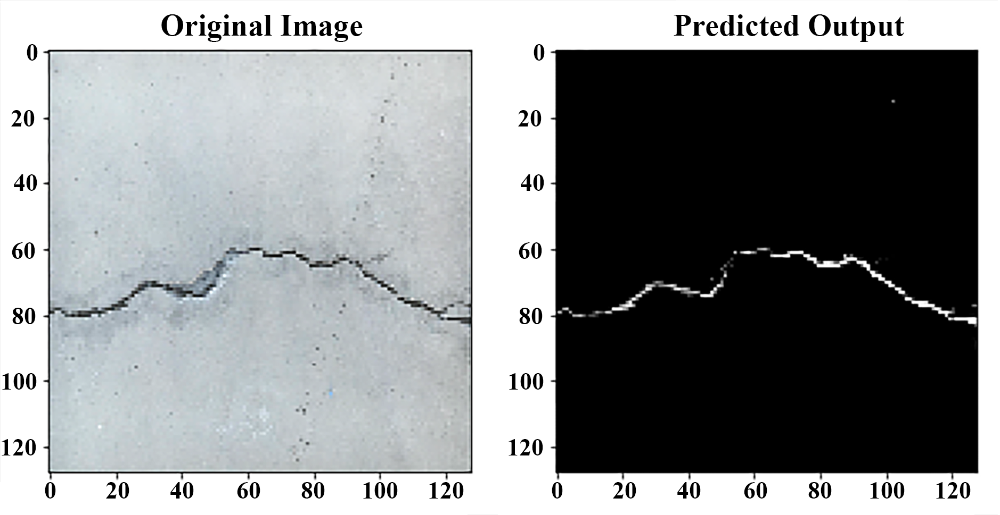
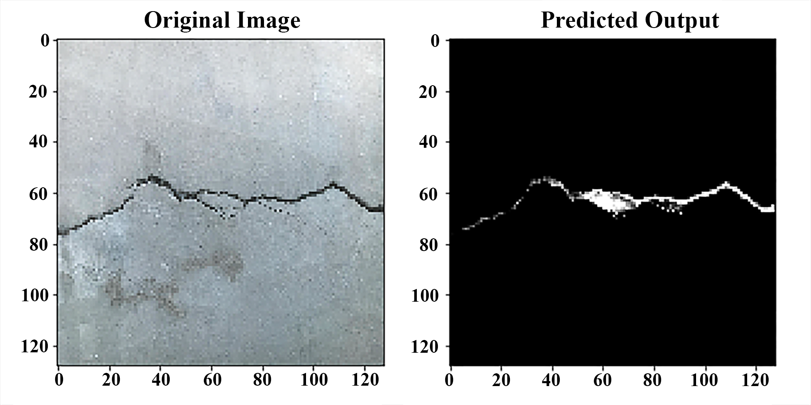
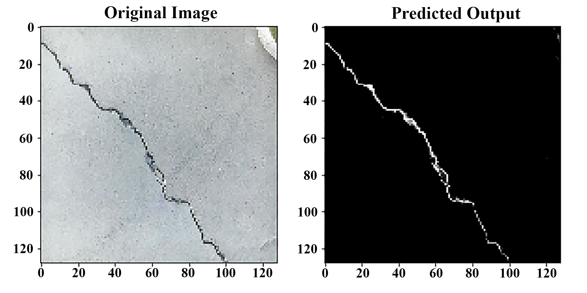

# Concrete Crack Segmentation

This repository implements a deep learning solution for segmenting cracks in concrete images using a Nested U-Net architecture. The model leverages custom loss functions and metrics to improve segmentation performance.

## Dataset

The dataset used for this project is the **Mendeley Concrete Crack Image Segmentation** dataset. You can download the dataset from the following link:

[Mendeley Concrete Crack Image Segmentation Dataset]([https://data.mendeley.com/datasets/2kr7r7v5s9/1](https://data.mendeley.com/datasets/p86fm2h39s/2))

## Folder Structure

Below is the recommended folder structure for organizing the project:

```plaintext
concrete-crack-segmentation/
├── data/
│   ├── train/
│   │   ├── images/         # Training images
│   │   └── masks/          # Corresponding training masks
│   └── test/
│       ├── images/         # Test images
│       └── masks/          # Corresponding test masks
├── model.py                # Contains the NestedModel class definition
├── load_image.py           # Utility functions for loading and augmenting images
├── matrics.py              # Custom metrics and loss functions
├── train.py                # Training and evaluation script
├── LICENSE                 # License file (e.g., MIT License)
```
## Model Architecture


The model is based on a customized Nested U-Net architecture designed for precise crack segmentation.



## 📊 Training Performance

### 🔹 Accuracy Curve


### 🔹 IoU Curve


## 🧪 Sample Predictions

Below are sample predictions from the model on test images:

| Image1 | Image2 | Image3 |
|-------------|--------------|----------------|
|  |  |  |


